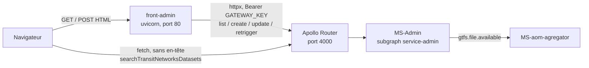

# Front-admin

Back-office web du catalogue de réseaux de transport. L'application ne détient aucune donnée : elle rend des pages HTML à partir des réponses de MS-Admin, qu'elle interroge en GraphQL au travers de la gateway Apollo.

| | |
|---|---|
| Langage | Python 3.12 (`.python-version`) |
| Web | FastAPI + Jinja2, rendu serveur |
| Formulaires | WTForms |
| CSS | Tailwind 4 + daisyUI 5, chargés par CDN |
| Port hôte | 8004 (80 dans le conteneur) |
| Persistance | Aucune |
| Amont | Gateway Apollo (port 4000), subgraph `service-admin` |

## Ce que fait l'application

Trois écrans, autour d'un seul objet métier : le réseau de transport enregistré par l'exploitant.

**Elle liste.** `GET /` appelle `getRegistredTransitNetworks` et rend un tableau des réseaux enregistrés avec leur état d'agrégation, traduit en pastille de couleur.

**Elle enregistre.** La page d'ajout propose une recherche par nom dans le catalogue transport.data.gouv.fr. Le choix d'une entrée pré-remplit le formulaire — identifiant externe, ville, code pays, ressources — et la soumission appelle `createTransitNetwork`.

**Elle consulte et relance.** La page de détail permet de modifier les métadonnées d'un réseau et de redéclencher son ingestion GTFS via `retriggerAggregation`, sans passer par un client GraphQL.

L'application est sans état côté serveur, à une exception près : une session signée par cookie, utilisée uniquement pour transporter les messages flash d'une redirection à la suivante.

## Architecture

Deux chemins d'appel distincts vers la même gateway, et c'est le point à comprendre en premier.



Les quatre opérations de lecture et d'écriture du registre partent du **serveur**, via httpx, avec un en-tête `Authorization: Bearer`. La recherche dans le catalogue data.gouv part du **navigateur**, en `fetch` direct et sans en-tête : elle renvoie environ 480 entrées qu'il serait absurde de faire transiter par le serveur à chaque frappe, le filtrage étant purement local (`fillingTransitNetworkFields.js`).

### Une seule variable pour deux points de vue

`URL_GATEWAY` sert aux deux chemins alors qu'ils ne voient pas le même réseau. Le serveur doit joindre la gateway depuis l'intérieur du conteneur, le navigateur depuis l'hôte.

Or `Properties` est une classe pydantic-settings, et **les variables d'environnement priment sur `application.properties`**. Le compose fournit `URL_GATEWAY=http://host.docker.internal:4000` : cette valeur est donc aussi celle injectée dans le gabarit et passée à `fetchToutesLesAOMs()`, où le navigateur ne sait pas la résoudre. Symptôme : tout fonctionne sauf le champ de recherche de la page d'ajout, qui reste vide avec une erreur réseau en console.

Séparer les deux valeurs est la seule sortie propre — les faire converger ne marche pas, `localhost:4000` désignant le conteneur lui-même côté serveur.

Second garde-fou à connaître : la gateway applique une liste blanche CORS déclarée dans `gateway/router.yaml`, qui contient `http://localhost:8004`. **Publier ce front sur un autre port casse la recherche** par un refus CORS, sans rien changer au reste de la page.

### L'en-tête `Authorization` ne protège rien aujourd'hui

`GATEWAY_KEY` est envoyé en `Bearer` sur chaque appel serveur. Le script `gateway/scripts/main.rhai` le décode comme un JWT, en dérive des en-têtes `x-user-*` et un `x-auth-state`, mais ne rejette jamais rien ; MS-Admin, de son côté, ne lit aucun de ces en-têtes. Une valeur qui n'est pas un JWT à trois segments produit simplement `x-auth-state: INVALID_TOKEN`, sans effet observable.

**Le back-office n'a donc aucune authentification.** Ni page de connexion, ni contrôle d'accès : quiconque atteint le port 8004 peut créer, modifier et relancer.

## Surface HTTP

| Route | Méthodes | Opération GraphQL appelée |
|---|---|---|
| `/` | GET | `getRegistredTransitNetworks(offset: 0, limit: 25)` |
| `/transit-networks/create` | GET, POST | `createTransitNetwork` |
| `/transit-networks/{external_id}` | GET, POST | `getRegistredTransitNetworks(0, 1000)` puis `updateTransitNetwork` |
| `/transit-networks/{external_id}/retrigger` | POST | `retriggerAggregation` |
| `/static/*` | GET | — |

Les routes de formulaire portent `@app.get` et `@app.post` sur la même fonction et se branchent sur `request.method` : un GET rend le formulaire, un POST le valide puis redirige en 303. Les erreurs de validation, elles, re-rendent le gabarit avec le formulaire annoté.

`retrigger` n'existe qu'en POST et redirige toujours vers la page de détail. Contrairement aux autres routes, il inspecte le corps GraphQL (`errors`, `data.retriggerAggregation`) et non le seul code HTTP : la gateway répond 200 sur une erreur métier, si bien qu'un contrôle sur `status_code` afficherait « Agrégation relancée » sur un échec.

### Lire un réseau coûte la liste entière

`get_transit_network_by_external_id_service` demande 1 000 réseaux et filtre en Python sur `externalId`. MS-Admin n'expose pas de query unitaire ; le commentaire dans `app/services/transit_network_service.py` le dit et pointe le remplacement attendu. La page de détail est donc en O(catalogue), pas en O(1).

## Formulaires

`TransitNetworkForm` est la classe mère ; `CreateTransitNetworkForm` et `ModifyTransitNetworkForm` n'en diffèrent que par le libellé du bouton. Les ressources sont un `FieldList(FormField(ResourceForm))`, alimenté côté navigateur par les lignes de tableau qu'injecte `fillResourcesFormFields()`, nommées `resources-<index>-<champ>` — la convention de nommage attendue par WTForms.

En lecture, `TransitNetworkResponseObj` fait la conversion de casse : l'API répond en `camelCase`, les champs du formulaire sont en `snake_case`, et les `validation_alias` pydantic absorbent l'écart en un seul endroit.

> **Modifier un réseau efface ses ressources.** La page de détail ne rend pas le `FieldList` des ressources. À la soumission, `form.resources.data` vaut donc `[]`, la mutation envoie `resources: []`, et `updateTransitNetwork` fait un `$set` du document reconstruit : la liste est écrasée en base. Or `retriggerAggregation` cherche l'URL du GTFS dans ces ressources avant de retomber sur `endpointUrl` — une relance après édition peut échouer faute d'URL.

> **Créer un réseau ignore le champ URL.** `endpoint_url` est affiché et validé sur la page d'ajout, mais `createTransitNetwork` ne le transmet pas : seul `updateTransitNetwork` le porte. La valeur saisie à la création est silencieusement perdue.

**La protection CSRF n'est pas active.** `wtforms.Form` a `Meta.csrf = False` par défaut et n'ajoute aucun champ ; `{{ form.csrf_token }}` rend une chaîne vide dans les trois gabarits. Il faut un `Meta.csrf = True` avec son `csrf_secret`, ou passer par une extension, pour que ces lignes fassent quelque chose.

## Pagination

Elle est présente à l'écran et inerte dans le code. `index()` accepte un paramètre `page` mais demande toujours `offset=0`. Les boutons rendus n'ont pas de lien. `range(1, data['totalPages'])` s'arrête un cran trop tôt et omet la dernière page. Enfin `data['page']` n'existe pas : `PaginatedTransitNetworks` expose `totalCount`, `totalPages`, `limit` et `offset`, jamais `page` — aucun bouton n'est donc jamais marqué actif.

Les filtres « Filtrer par état » et « Filtrer par type », le champ de recherche de la page d'accueil et le bouton « Exporter CSV » sont au même stade : présents dans le gabarit, branchés sur rien.

## Stack

| Brique | Choix | À savoir |
|---|---|---|
| Web | FastAPI 0.124 + uvicorn | Aucun `lifespan`, aucune connexion à maintenir |
| Gabarits | Jinja2 | `URL_GATEWAY` exposé en global de l'environnement |
| Formulaires | WTForms 3.2 | `Form` nu, sans intégration framework ni CSRF |
| HTTP sortant | httpx | Un `AsyncClient` créé par appel, sans réutilisation |
| Session | `SessionMiddleware` starlette | Uniquement les messages flash |
| CSS | daisyUI 5 + `@tailwindcss/browser@4` | Compilation dans le navigateur, aucune étape de build |
| Thème | `app/static/styles.css` | Redéfinit les jetons daisyUI ; `data-theme="light"` est figé dans `base.jinja` |
| Config | pydantic-settings | Deux sources séparées, voir ci-dessous |
| Dépendances | uv + `uv.lock` | Le venv est hors du projet, dans `/opt/venv` |
| Tests, lint | Aucun | Ni pytest, ni ruff, ni CI |

Trois dépendances déclarées ne servent pas : `tailwind` (paquet PyPI sans rapport avec le CDN réellement utilisé), `requests` (importé dans `main.py`, jamais appelé — tout passe par httpx) et `dotenv`, le shim, alors que `python-dotenv` arrive de toute façon avec pydantic-settings.

`app/templates/api_details.jinja` est un vestige de l'itération « APIs » qui a précédé les réseaux de transport : aucune route ne le rend, et il référence des champs `type` et `api_key` qu'aucun formulaire ne déclare plus.

### Deux fichiers de configuration, deux rôles

`app/core/config.py` déclare deux classes qui lisent deux fichiers différents. Confusion fréquente.

| Classe | Fichier | Contenu |
|---|---|---|
| `Secrets` | `.env`, non versionné | `GATEWAY_KEY`, `SECRET_KEY` |
| `Properties` | `application.properties`, versionné | `APP_NAME`, `DEBUG`, `LOG_LEVEL`, `URL_GATEWAY` |

Les variables d'environnement priment sur les deux — c'est ce qui permet au compose de surcharger `URL_GATEWAY`, et ce qui casse l'appel navigateur décrit plus haut.

`SECRET_KEY` est un cas à part : `config.py` le déclare dans `Secrets`, mais `main.py` le relit par `os.getenv` après un `dotenv.load_dotenv()`, sans passer par l'objet. Absent, la valeur transmise est `None`, que starlette convertit par `str()` : **le cookie de session est alors signé avec la chaîne littérale `"None"`**. Sans conséquence tant que la session ne porte que des messages flash, à corriger avant qu'elle porte autre chose.

## Démarrer depuis un clone neuf

> **Premier obstacle, immédiat.** Le compose déclare `env_file: - .env`. Ce fichier étant dans le `.gitignore`, un clone frais n'en a pas et `docker compose up` échoue avant même de construire l'image. Le modèle à recopier s'appelle `.env.exemple` — avec la faute.

1. Créer le réseau Docker partagé, s'il n'existe pas. Il est déclaré `external` par tous les composes du monorepo.

   ```bash
   docker network create hubert-network
   ```

2. Écrire le `.env` à la racine du dépôt, avec ces deux clés :

   ```
   GATEWAY_KEY=
   SECRET_KEY=changeme
   ```

   `GATEWAY_KEY` peut rester vide, rien ne le vérifie ni côté gateway ni côté MS-Admin. `SECRET_KEY` n'a pas de valeur par défaut utilisable : la renseigner évite la signature par `"None"`.

3. Démarrer l'amont, qui vit ailleurs dans le monorepo — la gateway et RabbitMQ à la racine, puis MS-Admin. Sans MS-Admin, toutes les pages répondent mais restent vides.

   ```bash
   docker compose -f ../../docker-compose.yml up -d gateway rabbitmq
   docker compose -f ../../microservices/MS-Admin/docker-compose.yaml up -d
   ```

4. Lancer le front.

   ```bash
   docker compose up -d
   ```

   **`make up` à la racine ne démarre pas ce dépôt** : la variable `FRONT` du Makefile ne pointe que sur `Front-user-app`.

5. Ouvrir `http://localhost:8004`. Le port compte : c'est celui que la liste blanche CORS de la gateway autorise.

6. Vérifier le chemin serveur, indépendamment du navigateur. Une liste vide sur une page qui s'affiche signifie que la gateway répond mais que le registre est vide ; une exception dans les logs signifie que la gateway est injoignable depuis le conteneur.

   ```bash
   docker logs -f front-admin
   ```

7. Vérifier le chemin navigateur, qui est le plus fragile. Sur `/transit-networks/create`, le champ « Rechercher une AOM » doit se dégriser en quelques secondes. S'il reste inerte, lire la console : un échec de résolution DNS désigne `URL_GATEWAY`, un refus CORS désigne l'origine de la page.

### Développer

Le compose monte le dépôt dans `/project` et lance uvicorn en `--reload` : toute modification de `main.py`, de `app/` ou des gabarits est prise en compte sans reconstruire. Seul un changement de `pyproject.toml` ou de `uv.lock` impose un `docker compose up -d --build`.

Hors Docker, le venv local suffit, à condition que la gateway soit joignable sur `http://localhost:4000` — la valeur par défaut d'`application.properties`.

```bash
uv run uvicorn main:app --reload --port 8004
```

### Après toute modification du schéma de MS-Admin

Le router Apollo valide chaque requête contre `gateway/supergraph.graphql`, un fichier statique chargé au démarrage. Renommer ou ajouter un champ dans MS-Admin sans recomposer laisse ce front en `GRAPHQL_VALIDATION_FAILED` sur toutes ses pages, alors que le subgraph interrogé en direct sur le port 8001 répond parfaitement.

```bash
make supergraph   # depuis la racine du monorepo
```

La recomposition introspecte les sept subgraphs et échoue si un seul manque à l'appel : ils doivent tous être démarrés.
